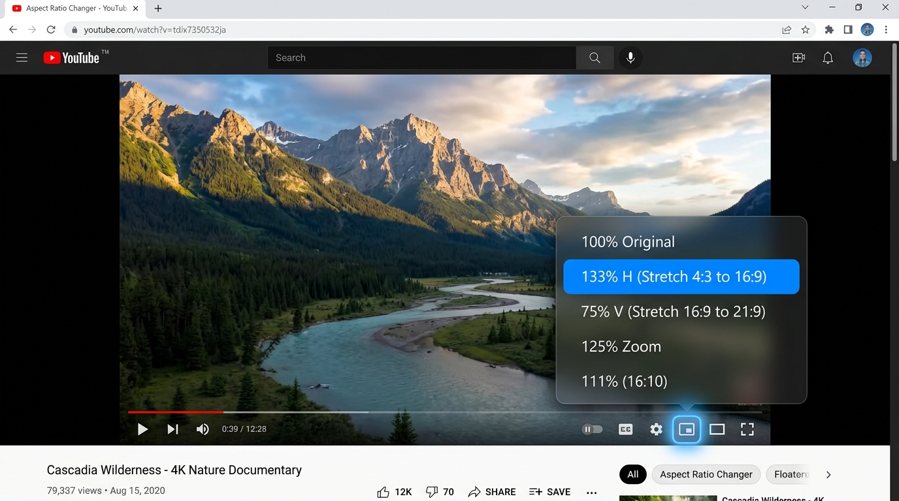
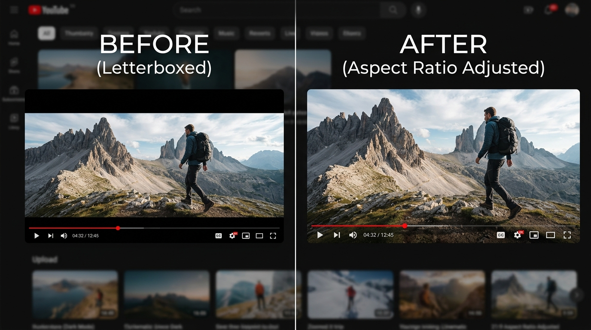

# Aspect Ratio Changer for YouTube™

[](LICENSE)
[](manifest.json)
[](tsconfig.json)
[](package.json)

A lightweight, zero-dependency Chrome Extension (Manifest V3) that allows you to easily adjust, zoom, and stretch video aspect ratios directly within the native YouTube player controls.

<p align="center">
  
</p>

---

## ✨ Features

- 🎯 **21 Calibrated Presets**: Easily switch between standard, ultrawide, and custom aspect ratios:
  - **Standard Ratios**: `100% (Original)`, `16:9`, `16:10`, `4:3`, `5:4`, `14:9`, `21:9`.
  - **Horizontal / Vertical Stretches**: `70% H`, `75% H`, `75% V`, `85% H`, `85% V`, `93% H`, `106% H`, `111% V`, `125% V`, `133% H`, `133% V`, `142% H`, `142% V`.
  - **Proportional Zooms**: `104% (WSS crop)`, `111%`, `114%`, `116%`, `125%`, `133%`, `142%`.
- ⚡ **Seamless Player Integration**: Embedded directly inside YouTube's bottom control bar beside the Settings menu.
- 🎨 **Modern Frosted Dark Glass UI**: Semi-transparent blurred dropdown menu matching YouTube's native design aesthetics.
- ⌨️ **Keyboard Accessibility**: Full keyboard support (`Enter`, `Space`, `Escape`) and ARIA-compliant attributes.
- 🔒 **100% Private & Local**: Zero data collection, zero network requests, zero telemetry.
- 🚀 **Zero Runtime Dependencies**: Built with vanilla TypeScript and compiled into a single ultra-lightweight script (< 12 KB).

---

## 📸 Screenshots

| Feature Menu | Before & After Comparison |
| :---: | :---: |
|  |  |

---

## 🛠️ Development & Building

### Prerequisites
- Node.js (v18+)
- npm

### Installation
```bash
git clone https://github.com/thienlhh/youtube-aspect-ratio.git
cd youtube-aspect-ratio
npm install
```

### Available Scripts
```bash
# Build production bundle (minified)
npm run build

# Build with sourcemaps for local debugging
npm run dev

# Watch mode for rapid development
npm run watch

# Run TypeScript type check
npm run type-check

# Run test suite
npm test

# Generate clean Chrome Web Store release package (.zip)
npm run package
```

---

## 📦 Loading Unpacked in Chrome (Local Testing)

1. Open Google Chrome and navigate to `chrome://extensions/`.
2. Enable **Developer mode** toggle in the top-right corner.
3. Click **Load unpacked**.
4. Select this project's root folder (`youtube-aspect-ratio`).
5. Open any [YouTube](https://www.youtube.com) video and enjoy full aspect ratio control!

---

## 📄 Privacy & Permissions

Aspect Ratio Changer for YouTube™ strictly adheres to privacy-first principles:
* **No user data** is collected, stored, or transmitted off-device.
* Content script execution is strictly limited to `https://www.youtube.com/*` and `https://youtube.com/*`.
* See full details in [PRIVACY.md](PRIVACY.md).

---

## ⚖️ Trademark Disclaimer

YouTube is a trademark of Google LLC. This extension is an independent project and is not affiliated with, sponsored by, or endorsed by Google LLC or YouTube.

---

## 📜 License

Distributed under the [MIT License](LICENSE). Copyright © 2026 Thien Le.
